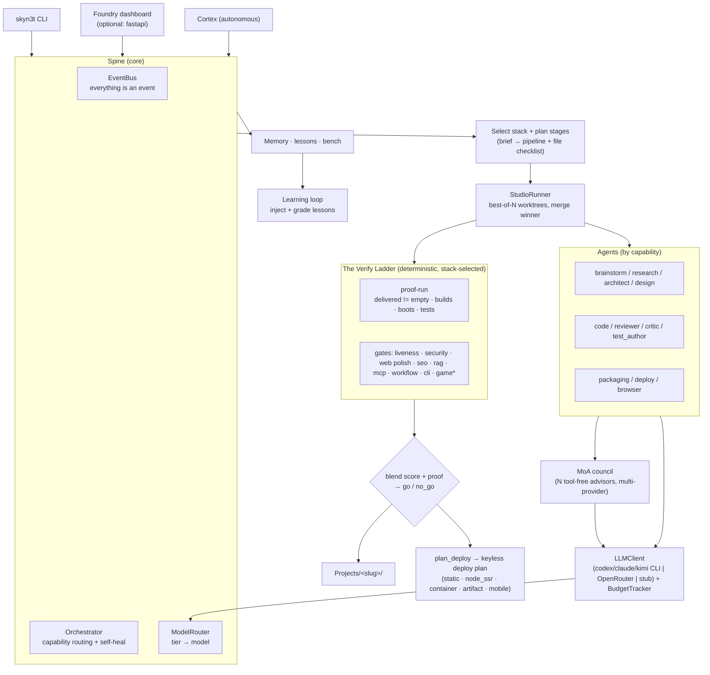

# SkyN3t 2.0

**An autonomous, multi-agent app factory.** Hand SkyN3t a plain-English brief
and it plans, builds, **proves**, critiques, and *ships* a working project —
any kind of app, not just web — running entirely offline by default and
reaching for paid models only when you opt in.

The thesis in one line: **others emit code; the Foundry proves it.** Every build
climbs a ladder of deterministic gates before it's allowed to call itself done.

---

## What it builds

One brief in; a routed, scaffolded, proven app out. The selector picks the stack
from your words — you don't have to.

| Domain | Stacks |
| --- | --- |
| **Web apps / SPAs** | `react` (Vite), `nextjs`, `astro`, `remix`, `static` (HTML/CSS/JS) |
| **Backends / APIs** | `fastapi`, `flask`, `django`, `express` (Node) |
| **Mobile** | `react_native` (Expo) |
| **Desktop** | `tauri`, `swift` (native macOS/SwiftUI) |
| **Games** | `phaser` (a small corner — most of the factory is non-game) |
| **AI-native** | `mcp` (Model Context Protocol servers), `rag` (retrieval apps), `workflow` (agent pipelines), `agent_pack` (persona/skill packs) |
| **CLIs / libraries** | `python`, `cli` |

Plus scaffold **variants** that ride existing stacks (three.js/3D, terminal-copilot,
LLM-gateway, market-data, memory-chat, a paper-trading finance core). New targets
follow a documented pattern — see [docs/ADDING_A_STACK.md](docs/ADDING_A_STACK.md).

---

## The Verify Ladder

A build isn't "done" because a model said so. It climbs a ladder of
**deterministic, stack-selected gates** — the signature capability that separates
this from prompt-to-code tools:

- **`delivered != empty`** — an objective *proof-run* checks that real, substantive
  files landed in `Projects/<slug>/` and, where the local stack tooling is
  available, collects build, boot, and test evidence. A missing optional tool is
  recorded as a skipped probe, never mistaken for proof. Not vibes; the artifact.
- **Stack-specific gates** fire only where they apply — `liveness`,
  `security_check`, `web_polish` + `seo_check` (web), `rag_check` (retrieval),
  `mcp_check` (MCP servers), `workflow_check` (agent pipelines), `cli_check`
  (CLIs), and `headless_gate` / `game_visual` / `qa_playtest` (games). The
  registry is drift-locked so a new stack can never be silently un-gated
  (`skyn3t/core/stacks.py`, `tests/test_stack_registry_drift.py`).
- The reviewer score is **blended with the proof result** into a single
  `go` / `no_go` verdict — a failing proof can't be talked past.

The dashboard renders this live as a molten forge-rail a build climbs, station by
station.

---

## Ship — the final rung

A proven build shouldn't die on `localhost`. `plan_deploy` emits a **keyless,
one-command deploy plan** for every stack — the right hosts, the exact command,
and a ready `Dockerfile` for servers:

| Kind | Stacks | Goes live via |
| --- | --- | --- |
| `static` | react/astro/remix-static/phaser/static | Cloudflare Pages / Netlify / Vercel |
| `node_ssr` | nextjs, remix | Vercel / Railway / Fly |
| `container` | fastapi, rag, workflow, express | Fly / Railway (Dockerfile emitted) |
| `artifact` | python/cli, agent_pack, mcp, swift, tauri | PyPI / GitHub Release |
| `mobile` | react_native | Expo EAS |

```bash
skyn3t deploy <build>            # show the plan (hosts + one-command deploy)
skyn3t deploy <build> --write    # also drop the generated Dockerfile
skyn3t deploy <build> --now      # confirm, deploy, health-check, then activate
```

For an instant shareable link without any provider account, `studio share`
boots the same loopback preview as `studio serve` and layers a public tunnel
over it — a Cloudflare quick tunnel when `cloudflared` is installed, else
localhost.run over the `ssh` client every OS already ships. No account is
created and nothing new is hosted; Ctrl+C tears the tunnel down first, then
the preview:

```bash
skyn3t studio serve <build>              # loopback-only local preview
skyn3t studio share <build>              # + a public URL (cloudflared/localhost.run)
skyn3t studio share <build> --no-tunnel  # exactly `studio serve`
```

Nothing is deployed or shared without explicit confirmation — `studio share`
IS the asking, and it refuses builds whose manifest marks them failed or
incomplete unless you pass `--force`. Personal-lab autonomy can remove routine
local build and budget approvals, but never this external boundary. Live
deploys require the
selected provider credential, stage only the files that provider needs, persist
the provider response, and activate a new live URL only after its health check
passes. A failed verification keeps the previous healthy URL active.

---

## Why it's different

- **Best-of-N trajectories.** The code stage samples N independent attempts in
  isolated worktrees and merges the winner (`--best-of N`).
- **Purposeful layouts, frozen at build start.** Operational web products use a
  responsive workspace composition rather than a generic card wall, while
  editorial, game, native, and utility builds retain their appropriate layout
  profile. The stored contract is restored for Improve instead of being guessed
  again; see [app types and layout profiles](docs/APP_TYPES.md).
- **Build decisions are reproducible.** Every build now carries a versioned
  selection/classification/layout contract with a stable digest, so the
  manifest and event stream show exactly how SkyN3t chose to build the app.
- **Design as a deterministic input, not a vibe.** Every web build gets a
  brief-derived design contract — AA-checked theme and accent (with an
  AA-fitted `--accent-text`), a curated font pair, a shape language, and a
  named layout archetype — injected beside the DESIGN BAR in codegen and
  persisted as `DESIGN.md` plus a versioned `.skyn3t/visual-design-contract.json`
  in the delivered tree. The visual editor and responsive proof reuse that same
  contract, so Improve runs do not drift and mobile/type regressions are visible. Advisory AI-look detectors (indigo gradients,
  Inter-first type, glassmorphism, placeholder copy, identical card grids)
  record on the manifest, brief-aware so invited playfulness never false-flags.
- **Adversarial critic gate.** A critic tries to break the result before delivery.
- **Closed learning loop.** Lessons are injected into stage prompts and graded by
  build outcome, so the factory gets measurably better over time.
- **Human design feedback, carried forward.** A local project review can be
  distilled into bounded, advisory design lessons. Those lessons are reused by
  later web and native UI builds, then credited by delivered outcomes; a failed
  build records neutral exposure unless it can identify a specific conflict.
  Feedback never executes code or changes runtime settings by itself.
- **Evidence-backed learning.** Prompt, skill-policy, and router-policy
  candidates can be compared against completed Golden ledgers and retained as
  immutable `review_required` evidence—never auto-applied. A GitHub ingest may
  distill separate candidates from a bounded set of commit-pinned Markdown
  guides; every one remains quarantined until its source, commit, path, and
  content hash are verified and explicitly promoted.
- **Curated local skill hubs.** Explicitly configured local Markdown hubs load at
  normal startup, retain a byte-hash receipt, pass hygiene classification, and
  expose a per-path audit report; they never execute hub scripts.
- **Lab research without blind activation.** The personal-lab profile removes
  repeat approval for bounded Repo Scout GitHub research, while every
  source-derived skill remains quarantined until its evidence is reviewed and
  explicitly promoted.
- **Controlled catalog activation.** Local agent catalogs import as evidenced,
  quarantined candidates; an explicit `activate=true` action validates the
  retained body and path before a role can guide a build.
- **Reliability as a number.** The default bench is app-factory focused; use
  `skyn3t bench run --suite all` or `--suite games` when you intentionally want
  game/full-stack coverage. Before/after gating keeps a change from lifting the
  average while silently regressing one app type. A second packaged suite,
  `skyn3t/benchmarks/golden-design-v1.json`, exams design distinctiveness
  specifically (`skyn3t bench golden run --suite skyn3t/benchmarks/golden-design-v1.json`).
- **Safe + observable by default.** Offline stub on, loopback-only web access,
  optional USD/token ceilings disabled unless you configure them, and exact
  provider cost evidence where available. Bounded safe Cortex actions may
  auto-approve; the personal-lab profile removes repetitive local build/budget
  friction while keeping proof and higher-impact action gates.
- **Degrade, don't crash.** Every optional dependency (FastAPI, Docker, ChromaDB,
  Playwright, embeddings, …) is guarded; missing deps degrade to a deterministic
  offline path.
- **Everything is an event.** Builds, stages, proposals, lessons, and health are
  events on one replayable, snapshot-able bus.

---

## Quickstart

```bash
# 1. Create a virtualenv (Python 3.11+).
python -m venv .venv
```

Activate it with `source .venv/bin/activate` on macOS/Linux or
`.venv\Scripts\Activate.ps1` in Windows PowerShell, then continue:

```bash
# 2. Install the package (dev extras include the complete test environment).
pip install -e ".[dev]"

# 3. Check readiness — what works offline vs. what needs keys.
skyn3t doctor

# 4. Build something. This runs end to end, fully offline.
skyn3t studio build "a FastAPI service to create and list short notes"

# 5. See what you built, and how it would ship.
skyn3t project list
skyn3t deploy <slug>
```

From a source checkout, the build lands in `../Projects/<slug>/` (sibling of
the repo). A wheel install keeps its writable data, logs, configuration, and
projects under `~/.skyn3t/` instead of writing into `site-packages`. Add API
keys to `.env` (see `.env.example`) only when you intentionally want a hosted
provider. `auto` walks `SKYN3T_AUTO_CLI_PRIORITY` (default `codex,kimi`)
and uses the first CLI you are signed in to; Copilot is supported but stays out
of that chain. Claude is supported but hard-fenced by default (`no_claude=true`):
disable that policy and select Claude explicitly before it can run. `auto` never
switches to OpenRouter merely because a key exists —
that needs explicit consent via `SKYN3T_AUTO_ALLOW_OPENROUTER=1`, or selecting
the OpenRouter backend in Foundry Settings (or `SKYN3T_LLM_BACKEND=openrouter`)
to use hosted API billing. With no signed-in CLI and no explicitly selected
provider, SkyN3t uses its deterministic stub so the whole pipeline still runs.

Two defaults worth knowing:

- **Gate posture is `lab`.** Only proof that the delivery is broken blocks a
  build. Heuristics, taste rules and environment-dependent probes record a
  finding, dampen the score and feed the fix loop, then let the build finish. A
  gate that *could not run* — no Docker, no Playwright — never blocks in any
  posture. Set `SKYN3T_BUILD_POSTURE=release` to make applicable completed gate
  findings blocking.
- **The Mixture-of-Agents council is on**, advised by `kimi_cli,copilot_cli,openrouter`
  by default — Claude only after you disable the hard fence and select it —
  adding multi-model engineering
  judgement deliberately not the acting model, so codegen is not reviewing its
  own work.
  It is inert unless those CLIs are signed in. See [docs/MOA.md](docs/MOA.md),
  including the honest cost note: a CLI advisor reports no price, so
  `per_build_usd_cap` cannot bound it.
- **Personal-lab autonomy is off by default.** Set `SKYN3T_LAB_AUTONOMY=1` only
  for a personal lab to remove routine local build approvals and budget guards.
  Proof and delivery gates still run; remote deploys, secret writes, destructive
  host actions, releases, and protected-branch merges stay explicitly gated.

### The Foundry — web control plane

```bash
pip install -e ".[web]"          # fastapi + uvicorn
skyn3t start --web               # boots the spine + serves the "Foundry" dashboard
```

The **Foundry** dashboard streams every build live: the Verify Ladder, the real
stage plan with the agent, score, cost, and gaps per stage, a files-so-far view,
and a live preview.

---

## CLI reference

| Command | What it does |
| --- | --- |
| `skyn3t start [--web] [--host H] [--port P]` | Boot the orchestrator, register agents, optionally serve the Foundry UI. |
| `skyn3t doctor` | Readiness table: python, deps, db, llm backend, sandbox, projects-dir. |
| `skyn3t studio build "<brief>" [--best-of N] [--no-critic] [--slug S]` | Run a build end to end; print result + artifact path. |
| `skyn3t studio serve <slug-or-path> [--port P]` | Run a delivered project as a live loopback preview (Docker-isolated when available; hardened local fallback otherwise). |
| `skyn3t studio share <slug-or-path> [--port P] [--no-tunnel] [--force]` | Serve locally AND expose a public URL via `cloudflared` (or localhost.run over `ssh`) — no account needed. |
| `skyn3t deploy <slug-or-path> [--target H] [--write] [--now]` | Show the deploy plan; optionally stage artifacts or confirm a live, health-gated deploy. |
| `skyn3t studio approve <id>` / `reject <id>` | Decide a gated build. |
| `skyn3t project list [--limit N]` | List recent builds from memory. |
| `skyn3t snapshot [--out PATH]` | Save the event-history snapshot to JSON. |
| `skyn3t domain ingest <path-or-url>` | Ingest a file/dir/URL into the RAG corpus. |

Every command imports its heavy machinery lazily, so the CLI starts fast and
tolerates missing optional packages.

---

## Architecture



---

## Docs

- [docs/START_HERE.md](docs/START_HERE.md) — reconnect after a disconnect
- [docs/ARCHITECTURE.md](docs/ARCHITECTURE.md) — package map + build dataflow
- [docs/EVIDENCE_LEARNING.md](docs/EVIDENCE_LEARNING.md) — build contracts, Golden evidence, and external-skill provenance
- [docs/SWARM_SKILLS.md](docs/SWARM_SKILLS.md) — runtime swarm handoffs, stage/repair skills, receipts, and catalog boundaries
- [docs/ADDING_A_STACK.md](docs/ADDING_A_STACK.md) — add a new build target
- [docs/APP_TYPES.md](docs/APP_TYPES.md) — UI/style defaults by app type
- [docs/WORKFLOW.md](docs/WORKFLOW.md) — operating playbook · [docs/FILE_MAP.md](docs/FILE_MAP.md) — where code lives
- [docs/ROADMAP.md](docs/ROADMAP.md) — feature backlog · [docs/FUTURE_IDEAS.md](docs/FUTURE_IDEAS.md) — where the factory goes next
- [docs/INDEX.md](docs/INDEX.md) — full docs index · older session ledgers live in [docs/archive/](docs/archive/)

Current state and the offline-vs-keys breakdown live in [STATUS.md](STATUS.md).

---

## License

MIT. See [LICENSE](LICENSE).
