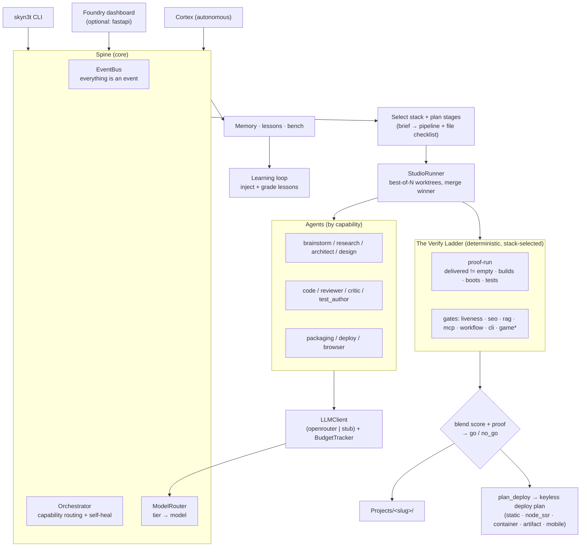

# SkyN3t 2.0

**An autonomous, multi-agent app factory.** Hand SkyN3t a plain-English brief
and it plans, builds, **proves**, critiques, and *ships* a working project —
any kind of app, not just web — running entirely offline by default and
reaching for paid models only when you opt in.

The thesis in one line: **others emit code; the Foundry proves it.** Every build
climbs a ladder of deterministic gates before it's allowed to call itself done.

---

## What it builds

One brief in; a routed, scaffolded, proven app out. The selector picks the stack
from your words — you don't have to.

| Domain | Stacks |
| --- | --- |
| **Web apps / SPAs** | `react` (Vite), `nextjs`, `astro`, `remix`, `static` (HTML/CSS/JS) |
| **Backends / APIs** | `fastapi`, `flask`, `django`, `express` (Node) |
| **Mobile** | `react_native` (Expo) |
| **Desktop** | `tauri`, `swift` (native macOS/SwiftUI) |
| **Games** | `phaser` (a small corner — most of the factory is non-game) |
| **AI-native** | `mcp` (Model Context Protocol servers), `rag` (retrieval apps), `workflow` (agent pipelines), `agent_pack` (persona/skill packs) |
| **CLIs / libraries** | `python`, `cli` |

Plus scaffold **variants** that ride existing stacks (three.js/3D, terminal-copilot,
LLM-gateway, market-data, memory-chat, a paper-trading finance core). New targets
follow a documented pattern — see [docs/ADDING_A_STACK.md](docs/ADDING_A_STACK.md).

---

## The Verify Ladder

A build isn't "done" because a model said so. It climbs a ladder of
**deterministic, stack-selected gates** — the signature capability that separates
this from prompt-to-code tools:

- **`delivered != empty`** — an objective *proof-run* checks that real, substantive
  files landed in `Projects/<slug>/` and (for the stack) that it actually builds,
  boots, and its own tests pass. Not vibes; the artifact.
- **Stack-specific gates** fire only where they apply — `liveness` + `seo_check`
  (web), `rag_check` (retrieval), `mcp_check` (MCP servers), `workflow_check`
  (agent pipelines), `cli_check` (CLIs), and `headless_gate` / `game_visual` /
  `qa_playtest` (games). The registry is drift-locked so a new stack can never be
  silently un-gated (`skyn3t/core/stacks.py`, `tests/test_stack_registry_drift.py`).
- The reviewer score is **blended with the proof result** into a single
  `go` / `no_go` verdict — a failing proof can't be talked past.

The dashboard renders this live as a molten forge-rail a build climbs, station by
station.

---

## Ship — the final rung

A proven build shouldn't die on `localhost`. `plan_deploy` emits a **keyless,
one-command deploy plan** for every stack — the right hosts, the exact command,
and a ready `Dockerfile` for servers:

| Kind | Stacks | Goes live via |
| --- | --- | --- |
| `static` | react/astro/remix-static/phaser/static | Cloudflare Pages / Netlify / Vercel |
| `node_ssr` | nextjs, remix | Vercel / Railway / Fly |
| `container` | fastapi, rag, workflow, express | Fly / Railway (Dockerfile emitted) |
| `artifact` | python/cli, agent_pack, mcp, swift, tauri | PyPI / GitHub Release |
| `mobile` | react_native | Expo EAS |

```bash
skyn3t deploy <build>            # show the plan (hosts + one-command deploy)
skyn3t deploy <build> --write    # also drop the generated Dockerfile
skyn3t deploy <build> --now      # confirm, deploy, health-check, then activate
```

Nothing is deployed without explicit confirmation. Live deploys require the
selected provider credential, stage only the files that provider needs, persist
the provider response, and activate a new live URL only after its health check
passes. A failed verification keeps the previous healthy URL active.

---

## Why it's different

- **Best-of-N trajectories.** The code stage samples N independent attempts in
  isolated worktrees and merges the winner (`--best-of N`).
- **Adversarial critic gate.** A critic tries to break the result before delivery.
- **Closed learning loop.** Lessons are injected into stage prompts and graded by
  build outcome, so the factory gets measurably better over time.
- **Reliability as a number.** The default bench is app-factory focused; use
  `skyn3t bench run --suite all` or `--suite games` when you intentionally want
  game/full-stack coverage. Before/after gating keeps a change from lifting the
  average while silently regressing one app type.
- **Safe + observable by default.** Offline stub on, autonomy gated behind
  approval, optional USD/token ceilings disabled unless you configure them,
  exact provider cost evidence where available, and loopback-only web access.
- **Degrade, don't crash.** Every optional dependency (FastAPI, Docker, ChromaDB,
  Playwright, embeddings, …) is guarded; missing deps degrade to a deterministic
  offline path.
- **Everything is an event.** Builds, stages, proposals, lessons, and health are
  events on one replayable, snapshot-able bus.

---

## Quickstart

```bash
# 1. Create a virtualenv (Python 3.11+).
python -m venv .venv
```

Activate it with `source .venv/bin/activate` on macOS/Linux or
`.venv\Scripts\Activate.ps1` in Windows PowerShell, then continue:

```bash
# 2. Install the package (dev extras include the complete test environment).
pip install -e ".[dev]"

# 3. Check readiness — what works offline vs. what needs keys.
skyn3t doctor

# 4. Build something. This runs end to end, fully offline.
skyn3t studio build "a FastAPI service to create and list short notes"

# 5. See what you built, and how it would ship.
skyn3t project list
skyn3t deploy <slug>
```

From a source checkout, the build lands in `../Projects/<slug>/` (sibling of
the repo). A wheel install keeps its writable data, logs, configuration, and
projects under `~/.skyn3t/` instead of writing into `site-packages`. Add API
keys to `.env` (see `.env.example`) to unlock real LLM backends; without them
SkyN3t uses a deterministic stub so the whole pipeline still runs.

### The Foundry — web control plane

```bash
pip install -e ".[web]"          # fastapi + uvicorn
skyn3t start --web               # boots the spine + serves the "Foundry" dashboard
```

The **Foundry** dashboard streams every build live: the Verify Ladder, the real
stage plan with the agent, score, cost, and gaps per stage, a files-so-far view,
and a live preview.

---

## CLI reference

| Command | What it does |
| --- | --- |
| `skyn3t start [--web] [--host H] [--port P]` | Boot the orchestrator, register agents, optionally serve the Foundry UI. |
| `skyn3t doctor` | Readiness table: python, deps, db, llm backend, sandbox, projects-dir. |
| `skyn3t studio build "<brief>" [--best-of N] [--no-critic] [--slug S]` | Run a build end to end; print result + artifact path. |
| `skyn3t deploy <slug-or-path> [--target H] [--write] [--now]` | Show the deploy plan; optionally stage artifacts or confirm a live, health-gated deploy. |
| `skyn3t studio approve <id>` / `reject <id>` | Decide a gated build. |
| `skyn3t project list [--limit N]` | List recent builds from memory. |
| `skyn3t snapshot [--out PATH]` | Save the event-history snapshot to JSON. |
| `skyn3t domain ingest <path-or-url>` | Ingest a file/dir/URL into the RAG corpus. |

Every command imports its heavy machinery lazily, so the CLI starts fast and
tolerates missing optional packages.

---

## Architecture



---

## Docs

- [docs/START_HERE.md](docs/START_HERE.md) — reconnect after a disconnect
- [docs/ARCHITECTURE.md](docs/ARCHITECTURE.md) — package map + build dataflow
- [docs/ADDING_A_STACK.md](docs/ADDING_A_STACK.md) — add a new build target
- [docs/APP_TYPES.md](docs/APP_TYPES.md) — UI/style defaults by app type
- [docs/WORKFLOW.md](docs/WORKFLOW.md) — operating playbook · [docs/FILE_MAP.md](docs/FILE_MAP.md) — where code lives
- [docs/ROADMAP.md](docs/ROADMAP.md) — feature backlog · [docs/FUTURE_IDEAS.md](docs/FUTURE_IDEAS.md) — where the factory goes next
- [docs/INDEX.md](docs/INDEX.md) — full docs index · older session ledgers live in [docs/archive/](docs/archive/)

Current state and the offline-vs-keys breakdown live in [STATUS.md](STATUS.md).

---

## License

MIT. See [LICENSE](LICENSE).
