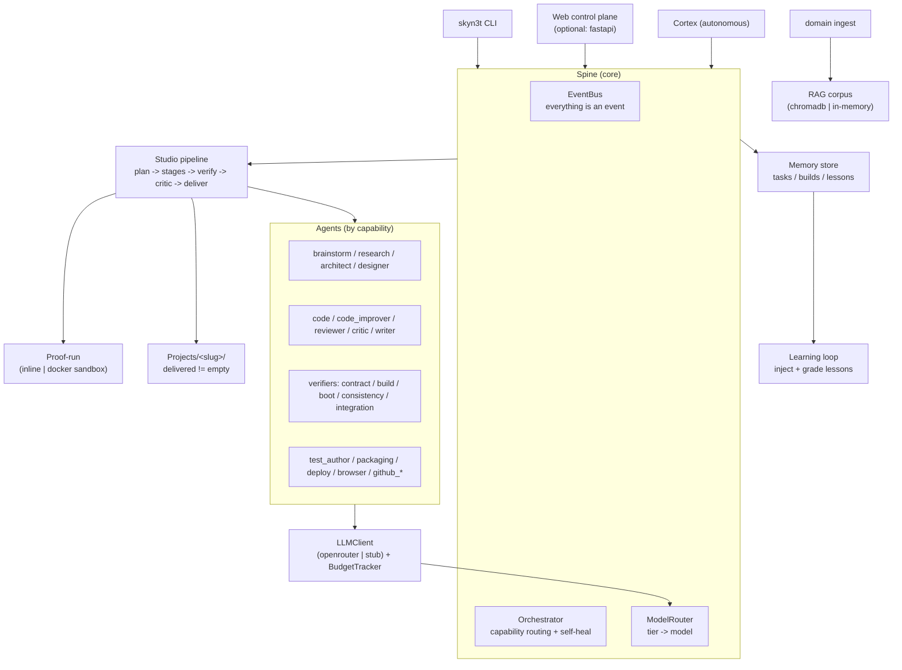

# SkyN3t 2.0

**An autonomous, multi-agent app factory.** You hand SkyN3t a plain-English
brief and it plans, builds, verifies, critiques, and *delivers* a working
project — running entirely offline by default, and reaching for paid models
only when you opt in.

SkyN3t is built on an event-sourced spine: an `EventBus`, an `Orchestrator`
that routes capability-tagged tasks to specialized agents, a memory store that
captures lessons from every build, and a `Studio` pipeline that turns a brief
into a delivered project tree. The 2.0 line adds trajectory sampling
(best-of-N), an adversarial pre-delivery critic, objective proof-runs,
self-healing, a knowledge/RAG corpus, and an autonomous Cortex.

---

## Why it's different (2.0 features)

- **Delivered != empty.** A build only succeeds if real, substantive files
  land in `Projects/<slug>/`. An objective *proof-run* checks the artifact, not
  the vibes.
- **Best-of-N trajectories.** The code stage can sample N independent attempts
  in isolated worktrees and merge the winner (`--best-of N`).
- **Adversarial critic gate.** A critic stage tries to break the result before
  delivery; disable per build with `--no-critic`.
- **Closed learning loop.** Lessons are injected into stage prompts and graded
  by build outcome, so the factory gets better over time.
- **Safe + cheap by default.** Free models on, autonomy gated behind approval,
  hard per-build/daily USD and token caps, loopback-only web access.
- **Degrade, don't crash.** Every optional dependency (FastAPI, Docker,
  ChromaDB, Playwright, embeddings, …) is guarded; missing deps degrade to a
  deterministic offline path instead of failing.
- **Everything is an event.** Builds, stages, proposals, lessons, and health
  are all events on one bus — replayable and snapshot-able (time-travel hook).

---

## Quickstart

```bash
# 1. Create and activate a virtualenv (Python 3.11+).
python -m venv .venv
source .venv/bin/activate

# 2. Install the package (with dev extras for tests).
pip install -e ".[dev]"

# 3. Check readiness — what works offline vs. what needs keys.
skyn3t doctor

# 4. Build something. This runs end to end, fully offline.
skyn3t studio build "a simple python cli that greets the user"

# 5. See what you've built.
skyn3t project list
```

The build lands in `../Projects/<slug>/` (sibling of the repo). Add API keys to
`.env` (see `.env.example`) to unlock real LLM backends; without them SkyN3t
uses a deterministic stub so the pipeline still runs.

### Optional: web control plane

```bash
pip install fastapi uvicorn      # optional dependency
skyn3t start --web               # boots the spine + serves the dashboard
```

---

## CLI reference

| Command | What it does |
| --- | --- |
| `skyn3t start [--web] [--host H] [--port P]` | Boot the orchestrator, register every available agent, optionally serve the web UI. |
| `skyn3t doctor` | Readiness table: python, deps, db init, llm backend, sandbox, projects-dir writability. |
| `skyn3t studio build "<brief>" [--best-of N] [--no-critic] [--slug S]` | Run a build end to end; print result + artifact path. |
| `skyn3t studio approve <id>` / `reject <id>` | Record an approval/rejection decision for a gated build. |
| `skyn3t project list [--limit N]` | List recent builds from memory. |
| `skyn3t snapshot [--out PATH]` | Save the event-history snapshot to JSON. |
| `skyn3t domain ingest <path-or-url>` | Ingest a file, directory, or URL into the RAG corpus. |

Every command imports its heavy machinery lazily, so the CLI starts fast and
tolerates missing optional packages.

---

## Architecture



If you are returning after a disconnect, start with
[docs/START_HERE.md](docs/START_HERE.md).
See [docs/ARCHITECTURE.md](docs/ARCHITECTURE.md) for the full package map and
dataflow, [docs/WORKFLOW.md](docs/WORKFLOW.md) for the operating playbook,
[docs/FILE_MAP.md](docs/FILE_MAP.md) for where code lives,
[docs/APP_TYPES.md](docs/APP_TYPES.md) for the UI/style defaults by app type,
[docs/ENGINE_OPTIONS.md](docs/ENGINE_OPTIONS.md) for engine choices, and
[docs/ROADMAP.md](docs/ROADMAP.md) for the feature backlog. Current state and the
offline-vs-keys breakdown live in [STATUS.md](STATUS.md).
