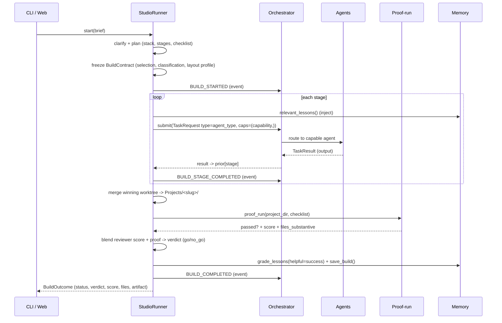

# SkyN3t 2.0 — Architecture

SkyN3t is an **event-sourced, capability-routed multi-agent factory**. A single
`EventBus` is the backbone; an `Orchestrator` routes capability-tagged tasks to
specialized agents; a `Studio` pipeline turns a brief into a delivered project;
a memory store closes the learning loop. Every layer degrades independently so
the system always imports and always runs.

## Package map

| Package | Responsibility |
| --- | --- |
| `skyn3t.config` | `Settings`/`get_settings` — typed config anchored to the repo root; safe defaults; `.env` loading. |
| `skyn3t.core` | The spine: `events` (EventBus/Event/EventType), `agent` (BaseAgent + task types), `orchestrator` (routing, concurrency, self-heal), `model_router` (tier -> model). |
| `skyn3t.adapters` | `llm` — `LLMClient` (`auto`, `stub`, `openrouter`, `codex_cli`, `kimi_cli`, `copilot_cli`, and policy-allowed `claude_cli`) with `BudgetTracker`/`BudgetExceeded`. `auto` uses signed-in local CLIs first and reaches OpenRouter only with explicit consent. |
| `skyn3t.agents` | One module per agent, registered by capability (brainstorm, research, architect, designer, code, code_improver, reviewer, critic, writer, verifiers, test_author, packaging, deploy, browser, github_*). |
| `skyn3t.studio` | `runner` (brief->app pipeline), `planner`, `stages`, `best_of_n`, `proof_run`, `manifest`, `approval_gate`, `clarification`. |
| `skyn3t.memory` | `store` (tasks/builds/lessons over SQLite), `models`, `ingestor`, plus consciousness/hygiene/tuner/meta-agent helpers. |
| `skyn3t.rag` | Knowledge corpus: `rag_engine`, `document_processor`, `embeddings`, `vector_store`, `retrieval`, `repo_map`. |
| `skyn3t.cortex` | Autonomous loop, proposal store, repo scout, prompt/tuning stores, an isolated verification-gated code candidate engine, and evidence-only configuration evaluation records. |
| `skyn3t.intelligence` | Debate, reflection, learning loop, model tournament, skill library, build patterns. |
| `skyn3t.web` | FastAPI control plane (`app`, `routes`, `websockets`, `deps`) — optional, loopback-safe. |
| `skyn3t.cli` | `main` — the Typer CLI (this package). |
| `skyn3t.security` / `observability` / `persistence` / `registry` / `integrations` / `self_healing` | Cross-cutting: sandbox hardening, metrics, durable state, agent registry, external connectors, recovery. |
| `skyn3t.worktree` | Isolated build worktrees + merge-back delivery. |

## Build dataflow

Key invariant: a build is only `completed` when delivered files are non-empty
**and** substantive (`delivered != empty`). Best-of-N runs the code stage in
parallel worktrees and merges the winner before delivery.

## CLI wiring (this package)

`skyn3t.cli.main` builds the spine on demand via `_assemble_spine()`:

1. `get_settings()` + a fresh `EventBus`.
2. `LLMClient` + `ModelRouter` (stub backend when no keys).
3. `MemoryStore.init_db()` (SQLite) — used as the orchestrator's persist sink.
4. `Orchestrator` with capacity from settings.
5. `build_agents()` imports every agent module and constructs each one with a
   **signature-aware** kwargs filter (agents differ: some take `llm`, some
   `llm_client`, some `memory`), then registers them by capability.

Every command does its heavy imports lazily inside the command body, so the CLI
starts fast and tolerates missing optional packages.

## Evidence-first learning

`BuildContract` makes each app-building decision durable: schema version 1
captures the selected stack, classification, frozen layout profile, build
profile, truthful template descriptor, and a stable content digest. The same
record appears in the build manifest, the `BUILD_STARTED` event, and stage
payload extras.

`skyn3t.cortex.evaluation` is a separate non-mutating lane for `prompt`,
`skill_policy`, and `router_policy` candidates. It accepts only narrow JSON
configuration data plus two already-completed Golden ledgers. It writes a
content-addressed evidence manifest; a passing comparison is still
`review_required`, while every other outcome is `rejected`. The record cannot
be `applied` or `promoted`.

Remote GitHub README text, plus a bounded set of small Markdown documents only
when fetched at a GitHub-supplied immutable commit SHA, is retained as
unreviewed RAG data and excluded from automatic prompt recall. Each distilled
external document skill remains quarantined until its canonical source URL,
immutable commit SHA, source path, and retained content hash pass explicit
local promotion. See
[Evidence-backed learning](EVIDENCE_LEARNING.md) for the CLI and exact
boundaries.

### Durable graph experiments

`GraphExecutor.rerun_descendants()` forks a completed graph from one selected
node, preserves the successful ancestor state, and forces only that node plus
its descendants to execute again. It persists an evidence-only snapshot and
content digests for the source and candidate runs; even an equivalent rerun is
`review_required`, never auto-promoted. `DynamicSpecialistSubgraph` is a
one-level fan-out/fan-in plan with a maximum of four children, explicit
workspace ownership for writers, per-plan concurrency, no nesting, and the
parent run's frozen routing snapshot. These runtime contracts define the boundary
for controlled Cortex graph experiments; no graph result changes code,
configuration, or policy by itself. The authenticated local `/api/cortex/graphs`
endpoint exposes bounded preflight-run metadata plus immutable comparison evidence;
the Cortex dashboard lets a human select one completed node and invoke
`/api/cortex/graphs/{run_id}/rerun`. That action produces a new review-only run,
never a promotion or a build-file mutation.

`/api/cortex/graph-reviews` is a separate human decision inbox over completed rerun comparisons. A decision is append-only, records `keep` or `reject` with the exact comparison digests and an optional note, and cannot be replaced or used as a promotion signal. A human may explicitly queue one follow-up through `/api/cortex/graph-reviews/{comparison_id}/build`, but only after `keep`; that request is recorded as its own immutable receipt and delegates to the normal Studio build route with its existing routing and admission checks. No graph review action automatically changes source files, policies, configuration, or skills.

## The 7 design rules

1. **Delivered != empty.** Success requires substantive files on disk, proven
   by an objective proof-run — never a self-graded claim.
2. **Close every learning edge.** Lessons are injected into stage payloads and
   graded by build outcome, so the corpus improves with use.
3. **Verify behavior, not vibes.** Verifiers + proof-run check the artifact;
   the reviewer/critic scores are blended with objective proof results.
4. **Safe by default.** Higher-impact autonomy is gated; bounded safe Cortex
   actions may auto-approve. `free_only` is on, optional USD/token caps are
   available but disabled until configured, web access is loopback-only, and
   sandbox hardening is on.
5. **Cheap by default.** `free_only=true`; the router prefers free tiers; the
   `BudgetTracker` enforces per-build and daily caps.
6. **Degrade, don't crash.** Every optional heavy dependency is import-guarded;
   a missing agent records a *skipped* stage and the build continues.
7. **Everything is an event.** Builds, stages, proposals, lessons, agent
   lifecycle, and health all flow through one `EventBus` — replayable and
   snapshot-able.

## Gate and autonomy policy

The default build posture is `lab`: objective delivery failures block, while
heuristic, policy, and environment-dependent findings are recorded, scored, and
fed into the repair loop. `release` makes applicable completed gate findings
blocking. A missing local prerequisite produces a visible skipped probe in either
posture, not a fabricated pass or failure.

`lab_autonomy` is separately off by default. When enabled for a personal lab it
removes routine local build approval and budget friction while retaining proof
and delivery gates. Remote deploys, secret writes, destructive host actions,
release publication, and protected-branch merges always require approval.
